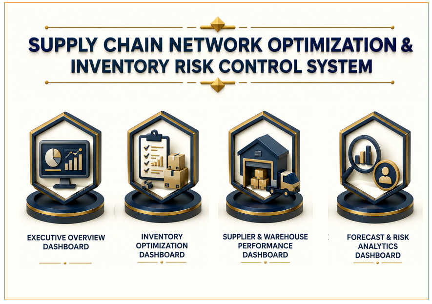
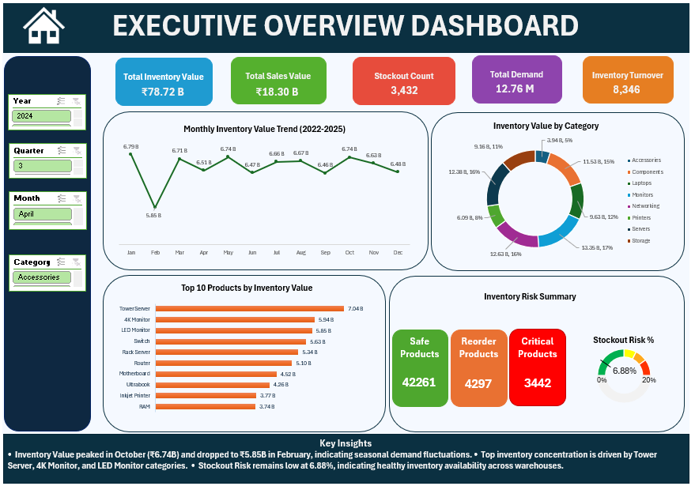
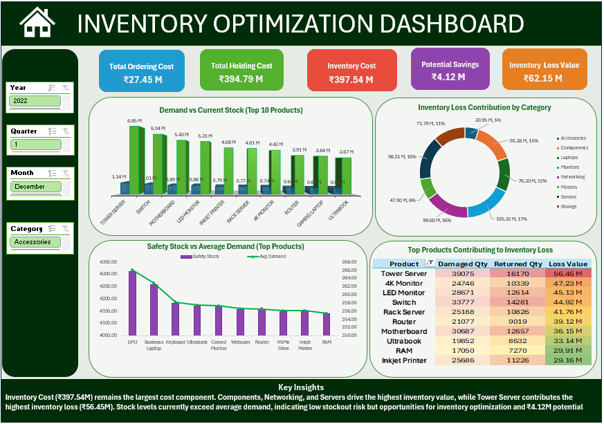
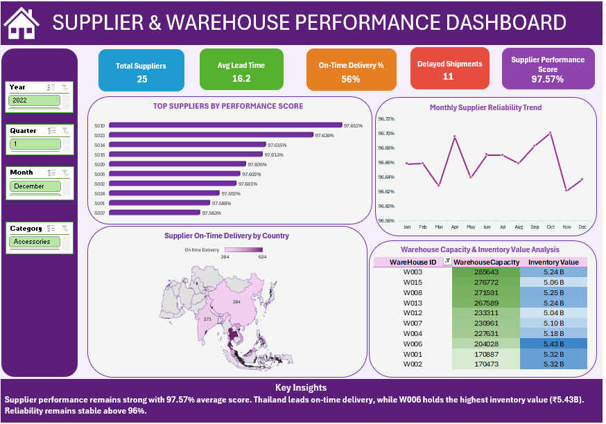
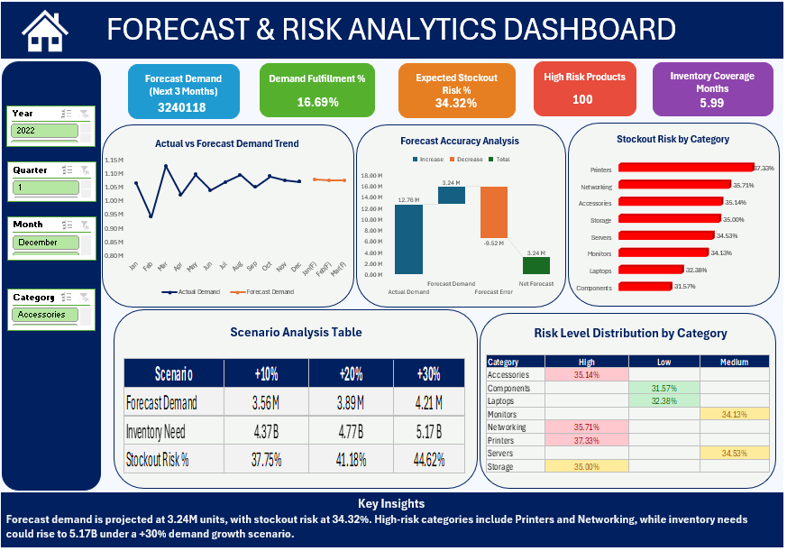

# 📦 Supply Chain Network Optimization & Inventory Risk Control System

This dashboard helps businesses optimize inventory, reduce stockout risk, improve supplier performance, and forecast future demand.

An end-to-end Business Intelligence project built using:

**Excel → Power Query → Power Pivot → DAX → Advanced Dashboarding**

---

---

## 📌 Project Overview

This project is a complete **Supply Chain Analytics & Inventory Risk Management System**.

I started with raw supply chain datasets containing product, inventory, warehouse, supplier, and operational data.

Using Power Query, I cleaned and transformed the data. Then I built a star-schema data model using Power Pivot and created advanced DAX measures for inventory optimization, supplier performance analysis, forecasting, and risk monitoring.

Finally, I developed a fully interactive Excel dashboard system to analyze:

- Inventory performance
- Inventory optimization opportunities
- Supplier performance
- Warehouse utilization
- Demand forecasting
- Stockout risk
- Inventory cost drivers

---

## 🗂️ Project Workflow

**Raw CSV Files → Power Query → Data Modeling → DAX Measures → Excel Dashboard System**

---

## 🛤️ Project Roadmap

---

## 🛠️ Tools & Technologies

| Tool | Purpose |
|------|---------|
| Excel | Dashboard Development |
| Power Query | Data Cleaning & Transformation |
| Power Pivot | Data Modeling |
| DAX | KPI & Business Calculations |
| Pivot Tables | Analysis & Reporting |
| Advanced Excel Charts | Visualization |

---

## 📁 Dataset

This project uses multiple supply chain datasets:

### 1. Product Dataset
- Product details
- Product category
- Product pricing

### 2. Inventory Dataset
- Current stock
- Demand quantity
- Inventory value
- Inventory cost

### 3. Supplier Dataset
- Supplier information
- Lead time
- Delivery performance

### 4. Warehouse Dataset
- Warehouse capacity
- Warehouse utilization
- Inventory allocation

### 5. Date Dataset
- Year
- Quarter
- Month
- Week
- Date hierarchy

---

## 🟦 Step 1: Power Query Work

### What I did

- Imported multiple CSV files
- Cleaned raw data
- Fixed data types
- Removed duplicates
- Handled missing values
- Standardized formats
- Created structured tables

### Output Tables

- tblProduct
- tblInventory
- tblSupplier
- tblWarehouse
- tblDate

---

## 🟨 Step 2: Data Modeling

### Star Schema Design

Created relationships between:

### Dimension Tables

- Product
- Supplier
- Warehouse
- Date

### Fact Table

- Inventory

### Key Fields

- ProductID
- SupplierID
- WarehouseID
- Date
- Category
- DemandQty
- CurrentStock
- InventoryValue

---

## 🟩 Step 3: DAX Measures

Created advanced business KPIs including:

### Inventory KPIs

- Total Inventory Value
- Total Inventory Cost
- Total Holding Cost
- Total Ordering Cost
- Inventory Loss Value
- Potential Savings

### Operational KPIs

- Stockout Count
- Stockout Risk %
- Inventory Turnover
- Inventory Coverage Months
- Demand Fulfillment %

### Supplier KPIs

- Supplier Performance Score
- On-Time Delivery %
- Average Lead Time
- Delayed Shipments

### Forecast KPIs

- Forecast Demand (Next 3 Months)
- Expected Stockout Risk %
- High Risk Products
- Scenario Analysis Metrics

---

# 📊 Dashboard Pages

---

## 🟦 Page 1 — Executive Overview Dashboard

### Purpose

Provide a high-level summary of inventory performance and operational health.

### KPIs

- Total Inventory Value
- Total Sales Value
- Stockout Count
- Total Demand
- Inventory Turnover

### Key Insights

- Monthly inventory trends
- Inventory value distribution
- Product concentration analysis
- Inventory risk overview

---

## 🟩 Page 2 — Inventory Optimization Dashboard

### Purpose

Identify inventory inefficiencies and optimization opportunities.

### KPIs

- Total Ordering Cost
- Total Holding Cost
- Inventory Cost
- Potential Savings
- Inventory Loss Value

### Key Insights

- Demand vs Current Stock
- Safety Stock Analysis
- Inventory Loss Contribution
- Inventory Cost Drivers

---

## 🟪 Page 3 — Supplier & Warehouse Performance Dashboard

### Purpose

Evaluate supplier reliability and warehouse efficiency.

### KPIs

- Total Suppliers
- Average Lead Time
- On-Time Delivery %
- Delayed Shipments
- Supplier Performance Score

### Key Insights

- Supplier ranking
- Delivery reliability trends
- Warehouse capacity analysis
- Inventory value distribution across warehouses

---

## 🟦 Page 4 — Forecast & Risk Analytics Dashboard

### Purpose

Forecast future demand and identify inventory risks.

### KPIs

- Forecast Demand (Next 3 Months)
- Demand Fulfillment %
- Expected Stockout Risk %
- High Risk Products
- Inventory Coverage Months

### Key Insights

- Actual vs Forecast Demand Trend
- Forecast Accuracy Analysis
- Stockout Risk by Category
- Scenario Analysis
- Inventory Risk Heatmap

---

## 📸 Dashboard Preview

### 🔹 Home Navigation Dashboard

### 🔹 Executive Overview Dashboard

### 🔹 Inventory Optimization Dashboard

### 🔹 Supplier & Warehouse Performance Dashboard

### 🔹 Forecast & Risk Analytics Dashboard

---

## ⭐ Key Features

- Interactive Home Navigation System
- Multi-Page Executive Dashboards
- Power Query ETL Pipeline
- Star Schema Data Modeling
- Advanced DAX KPIs
- Inventory Optimization Analysis
- Supplier Performance Monitoring
- Warehouse Capacity Analytics
- Demand Forecasting
- Scenario Analysis
- Inventory Risk Heatmap
- Executive Business Insights

---

## 💡 Key Business Insights

- Inventory value exceeds ₹78B, highlighting significant optimization opportunities.
- Inventory cost remains the largest operational expense component.
- Supplier performance remains strong with reliability above 96%.
- High-risk categories include Printers and Networking products.
- Demand growth scenarios indicate inventory requirements could exceed ₹5B.
- Stockout risk remains concentrated within a limited set of product categories.
- Warehouse utilization varies significantly across locations.

---

## 🧠 Skills Demonstrated

- Power Query
- Data Cleaning
- Data Modeling
- Power Pivot
- DAX
- KPI Development
- Dashboard Design
- Business Analysis
- Supply Chain Analytics
- Inventory Optimization
- Forecasting & Risk Analysis
- Data Storytelling

---

## ✅ Project Outcome

This project demonstrates a complete supply chain analytics and inventory risk management solution.

It helps organizations:

- Optimize inventory levels
- Reduce stockout risk
- Improve supplier performance
- Monitor warehouse efficiency
- Forecast future demand
- Control operational costs
- Improve decision-making

---

## 👨‍💻 About Me

**Sayan Naha**

📧 Email: snsayan2012@gmail.com

🔗 LinkedIn: https://www.linkedin.com/in/sayan-naha/
